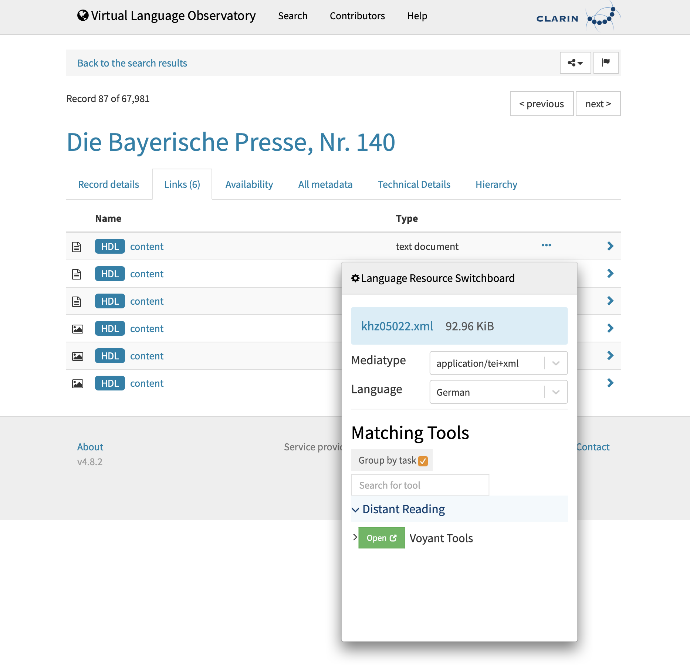

# Integrating a resource provider 

There are two ways a resource provider can connect to the Switchboard: 

1. by showing a Switchboard site popup integrated in the resource provider's 
site

1. by redirecting the client (browser) to the Switchboard site


# 1. Integrated Switchboard popup

The Switchboard popup can be displayed when the user presses a button or link on 
the integrator's repository site. The requirements are as follows:

* The repository site must include the Switchboard popup css and js files 
(usually in the html header): 
````html
    <link rel="stylesheet" type="text/css" href="https://switchboard.clarin.eu/popup/switchboardpopup.css" />
    <script type="text/javascript" defer="defer" src="https://switchboard.clarin.eu/popup/switchboardpopup.js"></script>
````

* A button or other element that should display the Switchboard popup when 
pressed must call the `showSwitchboardPopup` javascript function in the event 
handler:

````javascript
showSwitchboardPopup(
    {alignSelector: '#id3b6', alignRight: true},
    {url: 'http://hdl.handle.net/10932/00-01B8-AF6C-BC6A-0601-D'}
);
````

The `showSwitchboardPopup` function has two parameters. The first specifies the 
position of the popup in the html page, while the second specifies the resource
metadata to be sent to the Switchboard. 

The first parameter must be an object with the following properties: 
* `alignSelector` is mandatory and designates the selector for a page element 
used to position the popup. The popup will be placed right under this element 
and, by default, will be left-aligned with it. 
* `alignRight` is optional and can be used to require a right-alignment of the 
popup with the positioning element.

The second parameter must be an object with the following properties:
* `origin` is recommended and specifies a name or identifier of the calling 
application
* `url` is mandatory and specifies the actual data url
* `type` is optional and specifies the media type (MIME type) of the resource
* `language` is optional and can specify the language of the resource as a three
letter language code ([ISO 639-3](https://iso639-3.sil.org/))

## User interface example

This is how the Switchboard popup looks like when integrated in the 
[VLO](https://vlo.clarin.eu) repository: 


# 2. Redirecting the client (browser) to the Switchboard site

A resource provider can connect to the Switchboard by redirecting the client 
(browser) to the Switchboard site and providing specific information that serves
as input to the Switchboard's logic in doing so.

The following information can/has to be passed on to the Switchboard:

| Information | Description | Required? |
|-----|-----|-----|
| *origin* | Origin of the request - a name or identifier of the calling application | **Yes** |
| *URI* | Location or identifier of the potentially processable resource | **Yes** |
| *mimetype* | Media type (aka MIME type) of the potentially processable resource | No |
| *language* | Three letter language code ([ISO 639-3](https://iso639-3.sil.org/)) of the content language of the potentially processable resource | No |

## Client redirect

### URL pattern
```
{switchboard base URL}#/{origin}/{URI}[/{mimetype}[/{language}]]
```

* All values **have to be URL encoded**.
* For production, `{switchboard base URL}` is `https://switchboard.clarin.eu`
* An arbitrary identifying string for the calling service can be chosen for `{origin}`. The following are currently in use (non-exhaustive list):
  * `vlo`
  * `vcr`
  * `fcs`
  * `b2drop`
  * `d4science`

### Examples
* https://switchboard.clarin.eu/#/vlo/https%3A%2F%2Fwww.clarin.eu
* https://switchboard.clarin.eu/#/vlo/https%3A%2F%2Fwww.clarin.eu%2Fcmdi/application%2Fhtml
* https://switchboard.clarin.eu/#/vlo/http%3A%2F%2Fxmlns.com%2Ffoaf%2Fdoc%2FREADME.txt/text%2Fplain/eng

## User interface

The [VLO](https://vlo.clarin.eu) and [VCR](https://collections.clarin.eu) provide access to the switchboard through their resources listings.

### VCR
The VCR provides a drop down menu for each resource in the resources table of a collection. See for example [hdl:11372/VC-1002](http://hdl.handle.net/11372/VC-1002)


### VLO
Very much like the VCR, the VLO provides a drop down menu for each resource in the links section of a record page:


The VLO web app is implemented using [Apache Wicket](https://wicket.apache.org/). The UI part of the Switchboard connection is implemented in the [`ResourceLinksPanelItem`](https://github.com/clarin-eric/VLO/blob/master/vlo-web-app/src/main/java/eu/clarin/cmdi/vlo/wicket/panels/record/ResourceLinksPanelItem.java) class, where a [`LanguageResourceSwitchboardLink`](https://github.com/clarin-eric/VLO/blob/master/vlo-web-app/src/main/java/eu/clarin/cmdi/vlo/wicket/components/LanguageResourceSwitchboardLink.java) is instantiated.

## Video tutorial

On the [CLARIN ERIC Youtube channel](https://www.youtube.com/channel/UCJPks1mzisqsS4NrBFKIWag), you can find the video tutorial ["Connecting resource providers to the Language Resource Switchboard"](https://www.youtube.com/watch?v=YX5oGr949bQ).
